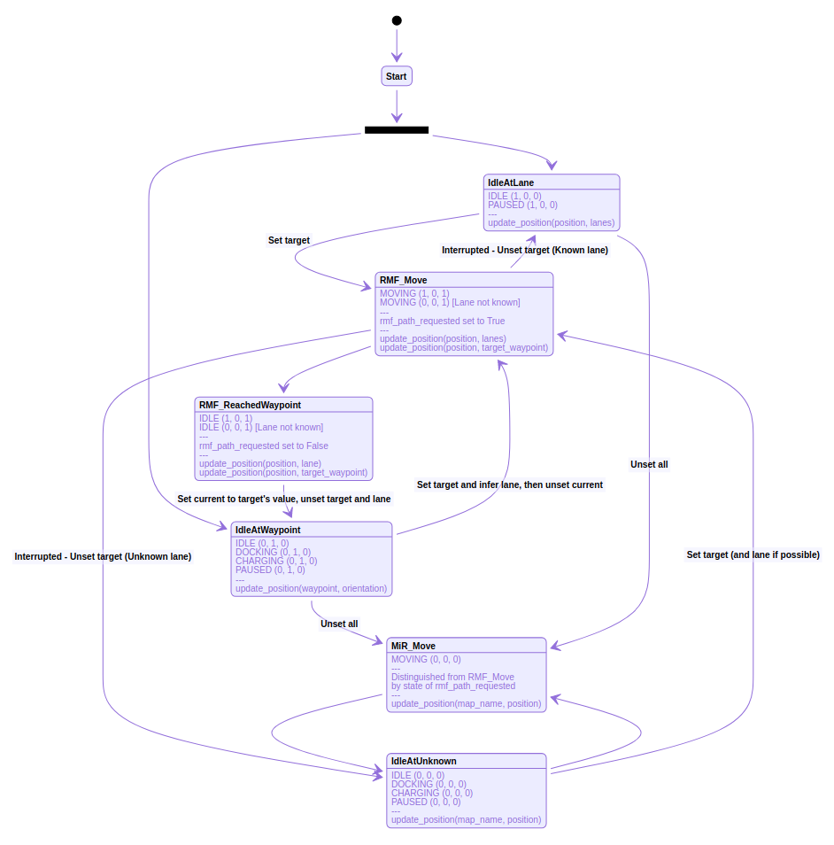

# fleet_adapter_mir
MiR100, 200 and 250 using the https://github.com/open-rmf/rmf_ros2/tree/main/rmf_fleet_adapter_python


## Pre-Requisites

- ROS 2 (Foxy onwards)
- [open-rmf](https://github.com/open-rmf/rmf) (source build recommended)


## Installation

If a source build of `open-rmf` is used, source the built workspace as an underlay, and build a new workspace with this repository.

```bash
# Create the MiR workspace and clone the repository
mkdir -p ~/mir_ws/src
cd ~/mir_ws/src
git clone https://github.com/osrf/fleet_adapter_mir

# Source the Open-RMF underlay workspace and build
source ~/rmf_ws/install/setup.bash
cd ~/mir_ws
colcon build
```


## Description

These packages implement a MiR command handle that is managed by a fleet adapter in Python. (Along with some helpers.) It can be used to command and manage a fleet of MiR robots using RMF!

It uses the `rmf_fleet_adapter_python` bindings, which allows for communication with `open-rmf` libraries and ROS2 nodes.

In effect, it interfaces the MiR REST API with `open-rmf`, all without needing to directly use ROS 2 messages to communicate with `open-rmf`!


### MiR vs. MiR Fleet

Since the MiR robots and MiR Fleet work with different sets of endpoints that serve different functions, both `fleet_adapter_mir` and `fleet_adapter_mirfm` packages are availble to demonstrate RMF integration between MiR100/200/250 and MiR Fleet respectively. In addition, the `mir_fleet_client` package provides additional API needed for the MiR Fleet + RMF integration.

For users who wish to take advantage of MiR Fleet's centralized control system/interface or do not have access to individual MiR robots, the `fleet_adapter_mirfm` package enables RMF integration with MiR Fleet by obtaining individual MiR robot positions and mission GUIDs via the MiR Fleet API and dispatching commands directly to the robots themselves. The current MiR Fleet API does not provide all the necessary endpoints for RMF to perform its task allocation and traffic deconfliction to the full extent, hence the implementation contains direct communication between RMF and MiR robots as well.

As such, it is recommended to implement the fleet adapter directly with individual MiR robots using `fleet_adapter_mir`.

**NOTE**: `fleet_adapter_mirfm` is currently not being actively supported.


## Additional Notes

### Different Units for Angles

MiR and RMF use different units for angles.

- MiR uses **degrees**
- RMF uses **radians**.

You might also have to clamp your angles to be within +-180 or +-3.14.


### Task IDs

Task IDs are kept as a monotonically increasing integer, with each robot having its own counter. They will be reflected as such in any `RobotState` messages that get published.


### Fleet States

`FleetState` publishing is done manually and not under the purview of the individual robot command handle instances. Each robot handle will internally update its corresponding `RobotState` message, so it is fairly trivial to aggregate them all into a `FleetState` message externally.

The example script `fleet_adapter_mir/fleet_adapter_mir.py` does this.


### Robot Transforms: Two Coordinate Systems

Since we are interfacing MiR and `open-rmf`, we need to deal with two coordinate systems and two forms of 'maps'.

We have to deal with the `rmf_traffic` navgraph and the MiR map, with their own individual coordinate systems, waypoints/positions, and waypoint keys/position names.

Luckily, we can leverage the `nudged` Python library to compute coordinate transforms between the two sets of coordinates. You just have to make sure to provide equivalent reference points within the two maps so transforms can be computed.

The transform objects are stored in the EasyFullControl fleet adapter handle.


### Very Involved: Location Tracking

> **Note**: You do **not** need to know this if you just want to use this package to control robots. This is here to help any developers that want to look into the source code's guts to understand why the code is written the way it is (and why there seem to be weird variables strewn about.)
>
> This will be helpful if you intend on writing other fleet adapters for other robots that communicate with REST APIs.

In order for the appropriate `RobotUpdateHandle.update_position()` method calls to be used, we need some way to track the location of the robot on the `rmf_core` navigation graph.

The trouble is, since we are using the MiR REST API, the only way we can obtain information about the robot's state is by polling it via REST calls.

Even harder than that, the MiR REST API does not care to store information about the `rmf_traffic` navigation graph, and any goals that are set with respect to that. In fact, the corresponding path following calls that `open-rmf` issues gets translated into move-to-coordinate missions for the MiR to execute.

This is **very messy**. Mainly because we cannot immediately infer the semantic state of the robot (with respect to RMF.) Instead, we have to infer it based off of what we know, from the tracking variables we are using, and the robot's mode.


#### **Trackers**

There are a couple of semantic states we need to be aware of, characterised by the state of the following tracker variables:

Three variables that keep track of location:

1. `current_waypoint`
2. `target_waypoint`
3. `current_lane`

The `RobotState` with the following robot modes:

- `MODE_MOVING` : Moving
- `MODE_CHARGING` : Charging
- `MODE_IDLE` : Ready
- `MODE_PAUSED`: Interrupted
- `MODE_DOCKING`: Docking

And a flag that gets set whenever the robot is executing a path following request from `open-rmf`:

- `rmf_path_requested`: `True` if executing a path request, `False` once complete


#### **Updating Position**

Additionally, there are four ways to update robot position. Listed in order of priority, or preference:

1. `update_position(waypoint, orientation)`
   - When the robot is at a waypoint
2. `update_position(position, lane)`
   - When the robot is in transit
3. `update_position(position, target_waypoint)`
   - When the robot is in transit but has lost track of the lane it is in
4. `update_position(map_name, position)`
   - When the robot is **completely lost**
   - Could potentially cause the robot to 'hop' around on the navigation graph, use as a last resort

> **Note:** Notice that this is a cool instance of method overloading that is invokable in Python! This is because of how the Python bindings were created! Different method calls are executed at the lower level!!


#### **Semantic States**

With this information, we can then infer the robot's meta/semantic state with respect to RMF, which will help inform us on what information is available to us, and hence what `update_position` call to use.

Then, we track how the semantic states transition as the robot goes about doing its business (changing the state of its tracking variables.)

Note, that in this case, all semantic states are **implicit** and are characterised and defined **purely by the state of the tracker variables listed above**!


#### **State Diagram**

Here's a state diagram to show how the states transition between themselves. But before that, here's the legend and some notes.


**State Diagram Legend**

```
<RobotMode> (current_lane, current_waypoint, target_waypoint)

For example, IDLE (0, 1, 0) implies:
- RobotMode: MODE_IDLE
- current_lane: None
- current_waypoint: Populated
- target_waypoint: None

If a state has multiple lines, the state might be in EITHER of those listed.

---

Additionally, any extra notes will be included after a --- in the description box
```


**Notes**

> **State Names**
>
> The state names are just there so we know intuitively what they mean. They do not represent actual variable names or values in the source code. Though they will be referenced in the comments so you know what they mean (hence semantic/meta states.)
>
> The states are characterised **ONLY** by the `RobotMode` and the status of the three tracking variables (which will be `None` or some `int`) and the `rmf_path_requested` variable (which will be `True` or `False`).
>
>
>
> **Robot Modes**
>
> Robot modes will change independently as the command handle keeps running its internal `update_internal_robot_state()` update method. We only need to keep track of how our states are changing and adjust the internal trackers accordingly.
>
>
>
> **Paused States**
>
> Paused states (interrupted) not included for simplicity.
>
> For those, just assume that any `target_waypoint` trackers will be `None`
>


**Diagram Time!**

