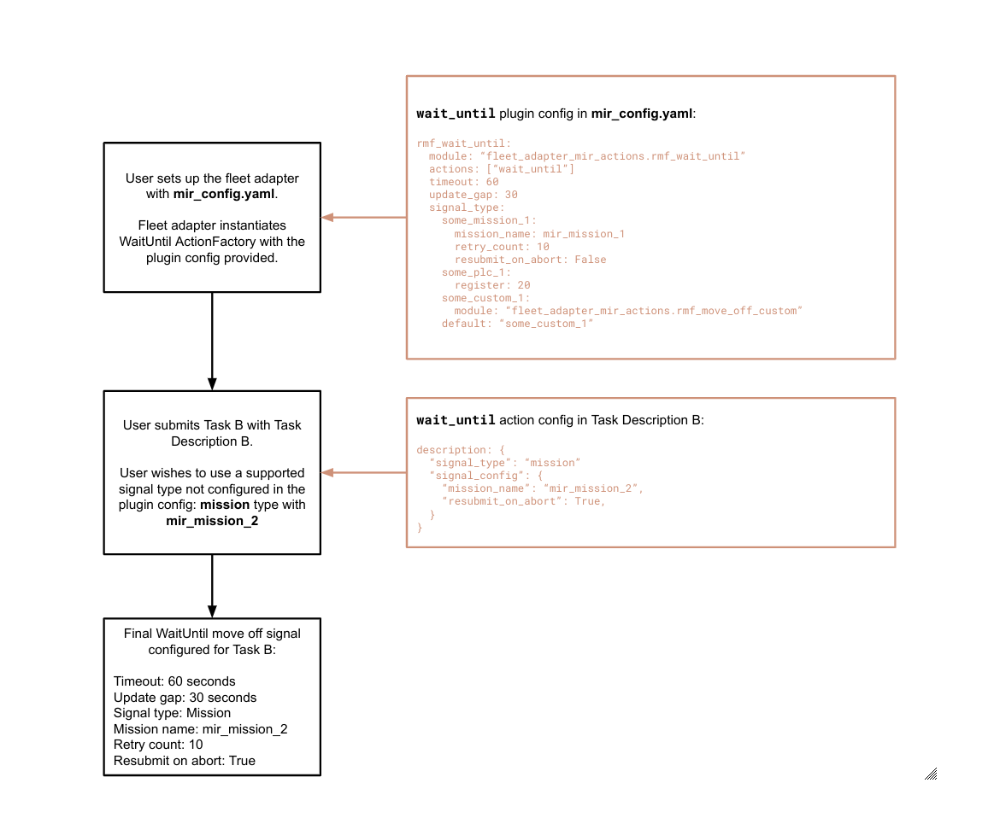
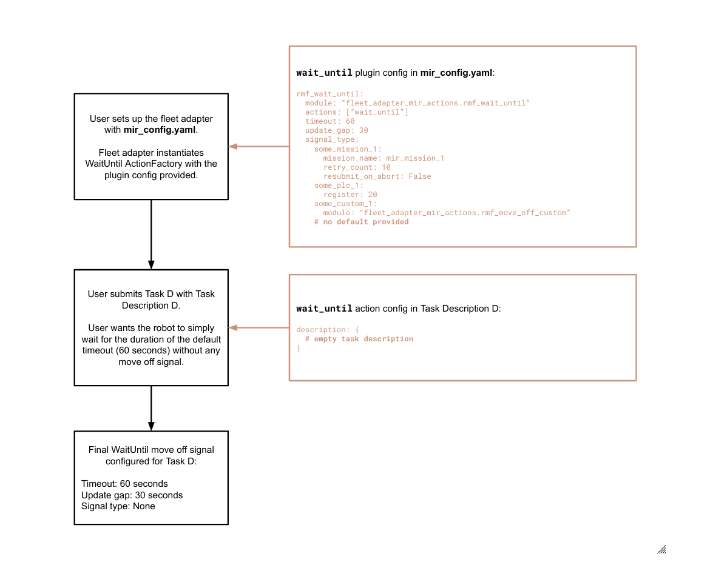

## MiR Action Plugins

This section lists and elaborates on the MiR actions provided out-of-the-box in this repo.

## Available Action Plugins

* [rmf_cart_delivery](#rmf_cart_delivery)
* [rmf_wait_until](#rmf_wait_until)


## rmf_cart_delivery

### Overview

The `rmf_cart_delivery` plugin allows users to submit pickup and dropoff tasks for MiR from point A to point B via RMF. The intended workflow of a delivery task is as follows:
1. RMF will send the robot to the pickup lot.
2. The robot will attempt to dock under a cart in the pickup lot. If the cart is missing or is not the desired cart, RMF will cancel the task.
3. If the robot successfully docks under the correct cart, it will latch onto the cart.
4. With the cart attached, the robot will move to the designated dropoff point.
5. Upon reaching the dropoff point, the robot will release and exit from under the cart. The task ends once the robot has safely exited.

### Setup

Some relevant MiR missions are pre-defined and can be automatically created on the MiR on startup. These missions are used to facilitate the pickup and dropoff activities. They are defined and stored in the `rmf_cart_missions.json` file and do not require any further configuration.

However, since there are various types of latching methods available for different MiR models, users will need to set up their custom pickup and dropoff missions on the MiR, as well as implement their own `CartDetection` plugin module with the appropriate APIs to detect latching states. A `BaseCartDetection` abstract class is provided the methods to be implemented.

Before setting up, you may want to refer to the [list of RMF missions](https://github.com/open-rmf/fleet_adapter_mir/blob/main/docs/mir_missions.md#RMF-missions-for-rmf_cart_delivery) required for this MiR Action.

Steps for setup:

1. Create 2 missions on the MiR:
   - `rmf_pickup_cart`: Triggers the robot's latching module to open
   - `rmf_dropoff_cart`: Triggers the robot's latching module to close and release the cart, then exit from under the cart (relative move in the negative X-direction)
2. Fill in the MiR mission names in the plugin config under `missions`.
   - This helps the fleet adapter identify and map the action to the missions you have created earlier.
   - The recommended mission names are `rmf_pickup_cart` and `rmf_dropoff_cart`, per the instructions in Step 1. However, it is possible to use a different mission name as long as it is indicated accordingly under `missions`.
3. Fill in the appropriate cart marker type in the plugin config under `marker_type`.
4. Create your own `CartDetection` plugin.
   - You are encouraged to use the `BaseCartDetection` class in `rmf_cart_detection.py` as a base for your own module implementation. The class methods will be used by the `CartPickup` and `CartDropoff` Mir Actions. Some API calls to check the MiR's PLC registers and IO modules are provided in case you may want to use them.
   - In the plugin config, update the `cart_detection_module` field to point to your own written module.
6. Enable RMF cart missions creation.
   - If this is your first time setting up the action, and the pre-defined RMF cart missions have not been created on your robot, you will need to provide the filepath to `rmf_cart_missions.json` under `missions_json`.

You can refer to `mir_config.yaml` under the `configs` folder for an example of a filled-in plugin configuration.


### Usage

To submit a cart delivery task, you may use the `dispatch_delivery` task script found in the `fleet_adapter_mir_tasks` package:
```bash
ros2 run fleet_adapter_mir_tasks dispatch_delivery -g go_to_waypoint -p pickup_lot -d dropoff_lot -c some_cart_id
```
- `-g`: Takes in an existing waypoint name for the robot to travel to before performing the pickup. The robot will begin docking into the pickup lot from this waypoint.
- `-p`: Name of the pickup lot. This name should be identical to the shelf position configured on the MiR.
- `-d`: Name of the dropoff lot. This name should be identical to the robot or shelf position configured on the MiR.
- `-c`: Optional cart identifier for the fleet adapter to assess whether the cart is correct for pickup. 


## rmf_wait_until

### Overview

The `rmf_wait_until` plugin introduces the `wait_until` action. It allows users to command a robot to wait at a specified location until it receives a move off signal or until a configured timeout. The robot would then be free to move on to carry out the remainder of its task, or complete the task and proceed to its idle behavior. During this waiting period, the user may command the robot to perform missions or any customized behavior with user-defined move off signals to trigger completion.

This action can come in handy for various use cases, for example:
- The robot has to perform a delivery where it travels between pick up and drop off locations, and wait at each location for an external device to load or unload items on itself.
- The robot is performing a MiR mission at a specific location, and is only ready to move off when the mission is completed.

Here is the workflow of a multi-stop task, demonstrating how the `wait_until` action can be used:
1. Users submit a task with a list of waypoints, RMF will send the robot to the first waypoint
2. The robot will stop at the waypoint and do nothing until it receives a move off signal or until a configured timeout.
3. Repeat Steps 1. and 2. until the robot has travelled to all the waypoints in the task.

This plugin currently supports three move off signal types:
1. Move off when a MiR mission completes.
   - Users may create/select a MiR mission on the robot and provide the mission name in the fleet config or task description. This mission will be submitted to the robot when the waiting action begins. The waiting action will end when the robot receives the move off signal, which in this case happens when the robot completes the mission.
2. Move off when a PLC register returns `True`.
   - When the waiting action begins, the fleet adapter will monitor the state of the PLC register specified in the fleet config or task description. When the register returns a non-zero integer or `True`, the waiting action will end and the robot will move on to its next waypoint or task. Numeric strings convertible to integers are also accepted, e.g. "1", "5".
3. Move off on a user-defined signal.
   - Users can customize their own signal type by implementing a `MoveOff` module.

The plugin also supports task-specific move off signals, such that different signal types can be used for different tasks or task phases. Users can specify signal types in the task description, which will override the default signal type provided in the plugin config. If additional config is missing in the task description, the fleet adapter will refer to default values from the plugin config (if provided).

It is possible to submit tasks with move off signals that have not been configured in the plugin config. However, it is up to the user to ensure that these signal types are valid and compatible with the MiR.

You may refer to the Examples section below to get a clearer idea of how to customize signal types with plugin config and task descriptions.

### Setup

Users can configure multiple move off signals for their robot fleet in the fleet's plugin config, up to one of each supported signal type. If the task description does not provide sufficient information to configure a signal type, the fleet adapter will refer to the plugin config. This is suitable for users who only require a single signal type for their tasks. If signal types are not configured in the plugin config nor the task description, the robot will not have a move off signal set up, and simply wait for the full duration of the timeout during the action.

Steps for setup:

1. Fill in the appropriate fields under the `rmf_wait_until` plugin in the fleet config, with reference to the example provided in `mir_config.yaml`. It allows users to customize the behavior of their robots during the waiting action and the type of signal to trigger move off.
   - `timeout`: Optional, the default timeout of the waiting action. At timeout, the robot will move off even if it did not receive the move off signal. If not specified, the timeout will default to 60 seconds. This value can be overridden by the task description.
   - `update_gap`: Optional, the update interval for logging purposes. If not specified, the update gap will default to 30 seconds. This value can be overridden by the task description.
   - `signal_type`: The type of move off signal for the robot. We currently support `mission`, `plc` and `custom`. You may configure default values for each supported signal type. These values act as default configuration to be used for the action. They may be overridden by the task description, with the exception of `custom` signals. This enables users to trigger different types of move off signals at runtime for the same robot fleet by submitting different task descriptions.
      - For the `mission` signal type, users will have to provide the following fields:
         - `mission_name` is required for the robot to trigger the relevant MiR mission when the waiting action starts. This is a compulsory field and may be overridden by the task description.
         - `retry_count` is an integer and an optional field, used to configure the number of times the fleet adapter should re-attempt posting a mission at the start of the waiting action. If the mission cannot be successfully queued on the robot beyond the number of retries, the task will be cancelled. This value can be overridden by the task description.
         - `resubmit_on_abort` is a boolean and an optional field, used to configure the action behavior in cases where the MiR mission cannot be successfully completed and gets aborted by the robot. When set to `True`, the fleet adapter will submit the same MiR mission to the robot if the previous attempt has been aborted. The move off signal will come only when the mission has been successfully completed. If set to `False`, the fleet adapter will treat aborted missions as completed and end the waiting action. This value can be overridden by the task description.
      - For the `plc` signal type, users will need to provide the relevant PLC register number. This register number should be an integer and available on the MiR. This value can be overridden by the task description.
      - For the `custom` signal type, users will need to fill in the path to their custom `MoveOff` module that is implemented from the `BaseMoveOff` abstract class provided.
      - The `default` field is optional but encouraged to be added. It should point to any one of the configured signal types. If no signal type is provided in the task description, the fleet adapter will select the `default` signal type from the plugin config as the move off trigger. If neither is provided, the robot will simply wait for the full duration of the timeout since it does not have a move off signal configured.
2. [Optional] Create your own `MoveOff` plugin.
   - You are encouraged to use the `BaseMoveOff` class in `rmf_move_off.py` as a base for your own module implementation. The class methods will be used by the `WaitUntil` Mir Action.
   - In the plugin config, update the `custom` field to point to your own written module.


### Usage

To submit a multi-stop waiting task, you may use the `dispatch_multistop` task script found in the `fleet_adapter_mir_tasks` package:
```bash
# Trigger a task using the default mission signal type and a timeout of 120 seconds
ros2 run fleet_adapter_mir_tasks dispatch_multistop -g waypoint_1 waypoint_2 waypoint_3 -t 120 -s mission

# Trigger a task using the mission signal type with a specific mission
ros2 run fleet_adapter_mir_tasks dispatch_multistop -g waypoint_1 waypoint_2 waypoint_3 -s mission -m some_mission_name

# Trigger a task using the default PLC signal type
ros2 run fleet_adapter_mir_tasks dispatch_multistop -g waypoint_1 waypoint_2 waypoint_3 -s plc

# Trigger a task using the PLC signal type with a specific PLC register
ros2 run fleet_adapter_mir_tasks dispatch_multistop -g waypoint_1 waypoint_2 waypoint_3 -s plc -p 30

# Trigger a task using the custom signal type
ros2 run fleet_adapter_mir_tasks dispatch_multistop -g waypoint_1 waypoint_2 waypoint_3 -s custom
```
- `-g`: Takes in the waypoints the robots should travel to for each waiting action.
- `-t`: Optional timeout of the action in seconds. Default to 60 seconds.
- `-u`: Optional update gap of the action in seconds. Default to 30 seconds.
- `-s`: Signal type for this `wait_until` action, currently support options are `mission`, `plc` and `custom`.
- `-m`: Further specifies the mission name for signal type `mission`.
- `-r`: A boolean determining whether to resubmit missions if they are aborted by the robot. Used for signal type `mission`.
- `-rc`: An integer indicating the number of times to reattempt queueing a mission. Used for signal type `mission`.
- `-p`: Further specifies the PLC register number for signal type `plc`.

Do note that this task involves using the same move off signal for every waypoint the robot travels to.

### Examples

<details>
<summary>Example 1: Overriding specific fields from plugin config using task description</summary>


</details>

<details>
<summary>Example 2: Configuring a signal type not found in plugin config</summary>


</details>

<details>
<summary>Example 3: Use WaitUntil's default timeout and select a configured signal type using task description</summary>


</details>

<details>
<summary>Example 4: Let robot simply wait during the action without any move off signal configured</summary>


</details>
